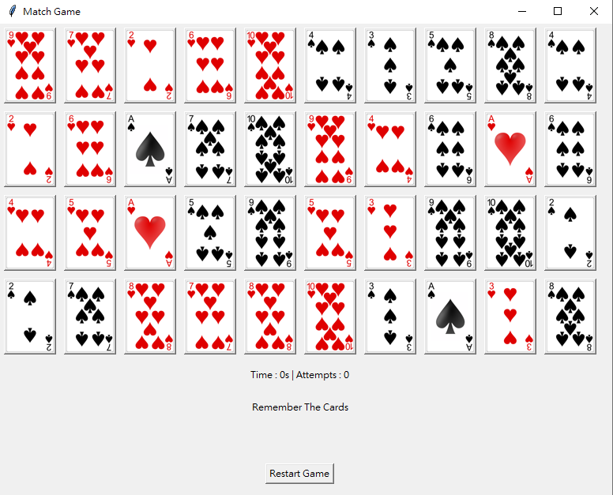
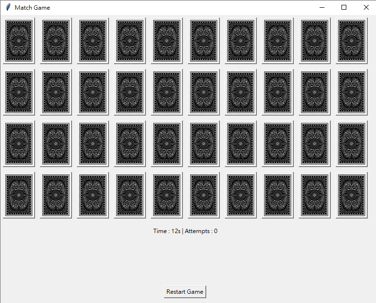
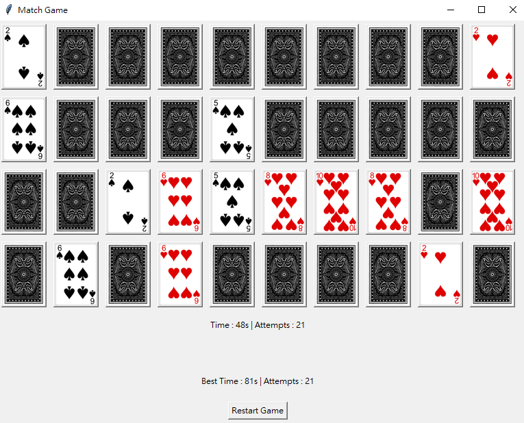
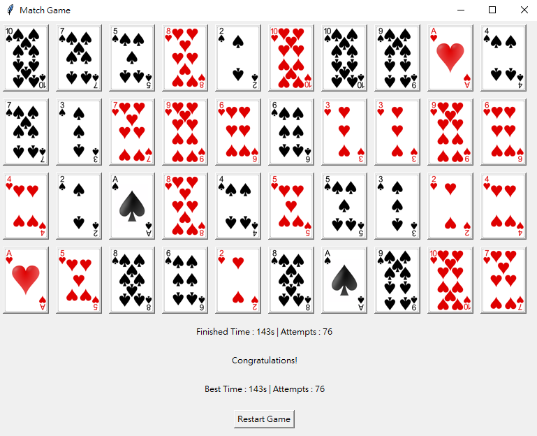

# Match Cards

**20 pairs of cards – try to match them.**

## How to Run

There are two ways to play this game:

1. **Run with Python**
   - Make sure you have a Python environment.
   - Use CMD (or terminal) to run:
     ```bash
     python MatchCards.py
     ```

2. **Run the Executable**
   - Just double-click `MatchCards.exe`.

**Note**: The image files are a must. 
You can replace them with your own images, but the file names must be:
`1.png` ~ `20.png` and `back.png`.

---

## Game Introduction

- At the start, you have **10 seconds** to memorize the cards.
- Then the game begins, with a **timer** and an **attempt counter**.
- Flip two cards:
  - If they **match**, they stay open.
  - If not, they will close again.
- Each new game (whether at launch or after pressing restart) will **shuffle the cards randomly**.
- Match all pairs to win! 
- The game will remember your **best record**.
- A **restart button** is available if you want to try again.

## Screenshots





---
